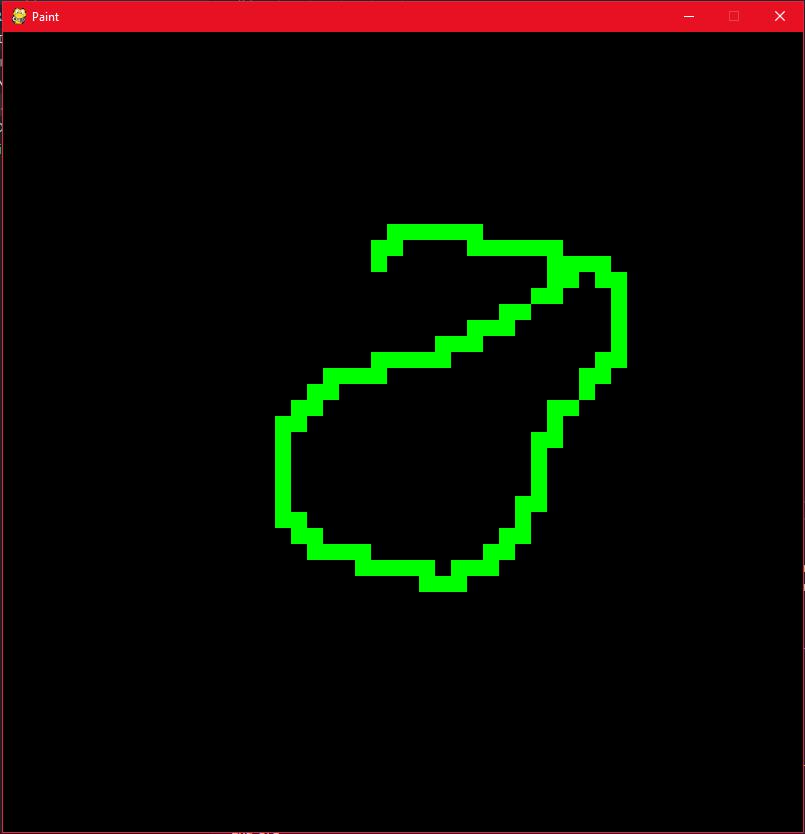
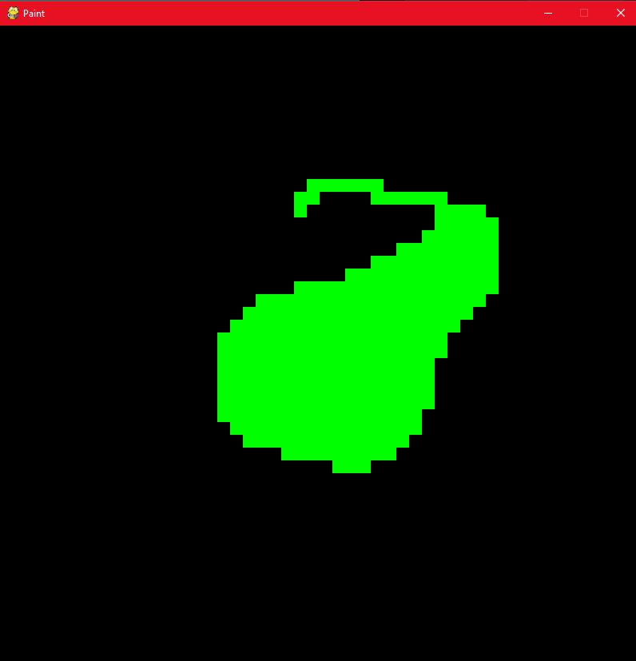

# Lista6_Daniel_Gabriela

## Autores

| Nome  | Matrícula  | GitHub | Email |
|---|---|---|---|
| Daniel Maike Mendes Gonçalves  | 16/0117003  | [DanMke](https://github.com/DanMke) | danmke@hotmail.com |
| Gabriela Medeiros da Silva	  | 16/0121817 | [gabiMSilva](https://github.com/gabiMSilva) | gabriela.medeiros2010@hotmail.com.br |

## Instalação

> * ``` git clone https://github.com/EDAII/Lista6_Daniel_Gabriela.git ``` <br> <br>
> * ``` pip3 install -r requirements.txt --user ```

## Execução

> * ```python3 main.py ``` ou ```python main.py ```

## Atalhos no programa

* TAB - Para desenhar aperte TAB, e quando for para parar de desenhar clique em TAB novamente.
* Botão direito do mouse - Usa o balde com o algoritmo de busca por largura 
* Botão esquerdo do mouse - Usa o balde com o algoritmo de busca por profundidade 
* Tecla E - Para apagar use a borracha na tecla E, e desenhe com TAB ou use o balde com um dos botões do mouse.
* Tecla G - Para trocar para a cor VERDE.
* Tecla O - Para trocar para a cor LARANJA.
* Tecla R - Para trocar para a cor VERMELHA.
* Tecla B - Para trocar para a cor AZUL.
* Tecla Y - Para trocar para a cor AMARELA.

## Imagens do funcionamento



* Ao clicar dentro do desenho

